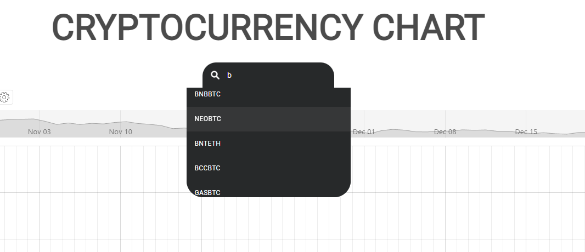
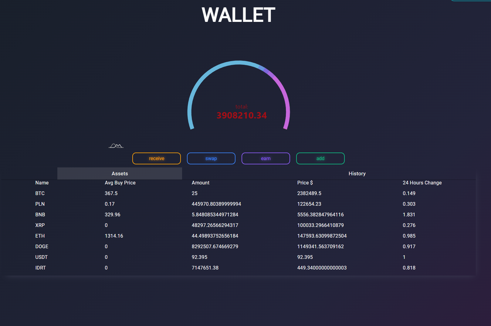

# BTC App

A web application for exploring cryptocurrency data: **interactive charts**, **currency pair search**, and a **wallet view with a full transaction history**.
The app also supports connecting to a database hosted on **Amazon (AWS)** (e.g., Amazon RDS).

---

## Features

### 📈 Charts

* view charts for selected assets/pairs
* change the displayed pair and analyze price movements *(adjust if you have more options)*

### 🔎 Pair search

* search and filter cryptocurrency/fiat pairs (e.g., BTC/USDT, ETH/EUR)
* quickly find the pair you want to display on charts

### 👛 Wallet

* wallet view with all transactions
* browse the full transaction history in one place
* data loaded from / stored in the database

### ☁️ AWS database support

* connect the application to a database hosted on Amazon (AWS)
* works with a remote MySQL database (commonly Amazon RDS)

---

## Screenshots

> Replace the filenames with the exact ones used in your repository.

### Charts

### Pair search

### Wallet & transactions

---

## Tech Stack

* Java
* Servlet/Tomcat, Hibernate/JPA, MySQL
* Frontend: HTML / CSS / JavaScript

---

## How to run

### Requirements

* Java (e.g., 17+)
* Maven (or Maven Wrapper `mvnw`)
* MySQL (local) **or** an AWS-hosted database (RDS)

### Database configuration

#### Option A: Local database (localhost)

#### Option B: AWS (Amazon RDS)

**Important (AWS):**

* your RDS instance must allow external access (Public access / networking)
* the Security Group must allow inbound traffic on port **3306** from your IP

Tip: store secrets in environment variables instead of committing them to the repo.

---

## Author

Dominik (dominikoka)
